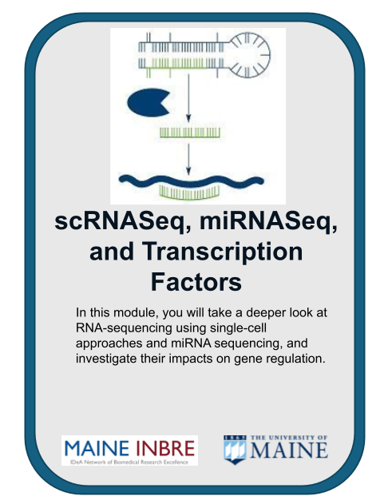
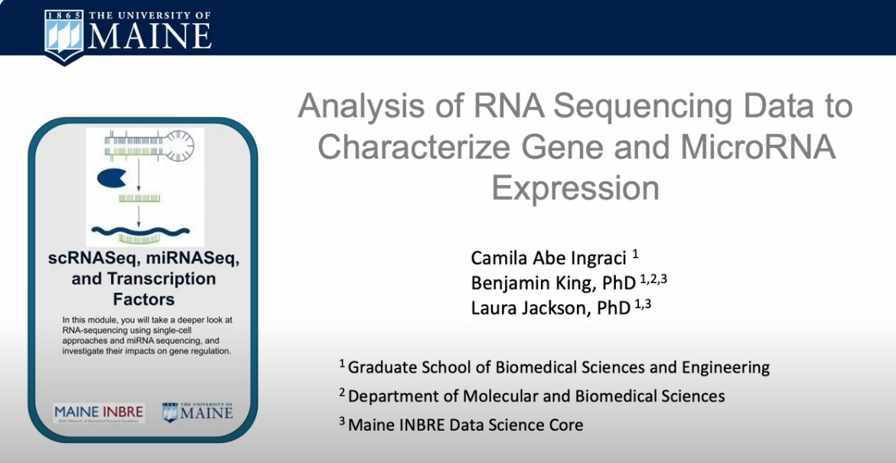
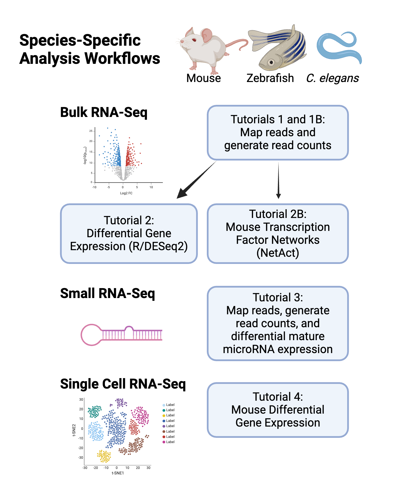
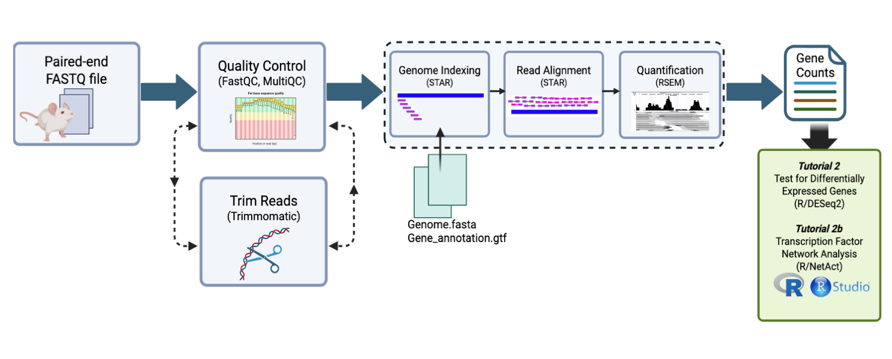
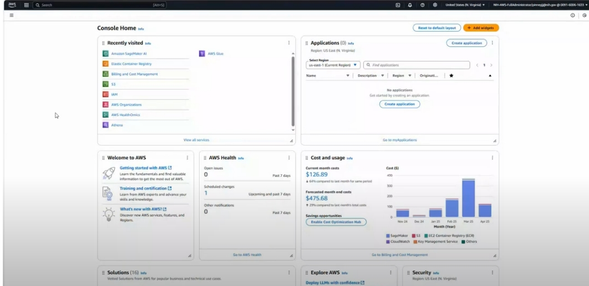
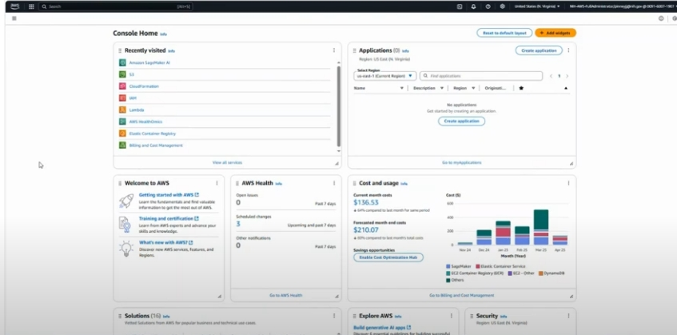

[comment]: <> (Hi. If you are seeing this message, please open this file with markdown preview or jupyter notebook. You can do this by right clicking on the readme file and picking 'open with'.)

# University of Maine Gene and microRNA Expression Using RNA-Seq and Network Analysis

    

## Table of Contents

+ [Overview](#overview)
+ [Background](#background)
+ [Workflows](#workflows)
+ [Data](#data)
+ [Getting Started](#getting-started)
+ [Funding](#funding)  

   
## Overview

The purpose of these tutorials is to help users familiarize themselves with RNA sequencing (RNA-Seq) analysis workflows using Cloud computing. These tutorials do this by going step-by-step through specific workflows for bulk RNA-Seq, small RNA-Seq and single cell RNA-Seq (scRNA-Seq). To make these tutorials applicable to researchers who use different model organisms, we provide workflows for mouse, zebrafish and *C. elegans*. The bulk RNA-Seq and small RNA-Seq workflows cover the start to finish of basic bioinformatics analysis; starting from downloading raw sequence data, and extending to differential gene expression analysis, and producing common plots in R. For mouse, we provide transcription factor network analysis using [NetAct](https://github.com/lusystemsbio/NetAct) ([Su *et al. Genome Biol.* (2022)](https://pubmed.ncbi.nlm.nih.gov/36575445/)) and scRNA-Seq workflows.

- **Bulk RNA-Seq:**
    - Sequence read preprocessing and mapping to generate read counts using [RSEM](https://github.com/deweylab/RSEM) and [Ensembl](https://www.ensembl.org) annotation of current genome assemblies.
    - Analysis of read counts to generate lists of differentially expressed genes using [R/DESeq2](https://bioconductor.org/packages/release/bioc/html/DESeq2.html).
    - Analysis of transcription factor networks using [NetAct](https://github.com/lusystemsbio/NetAct) (mouse only). 
- **Small RNA-Seq:**
    - Sequence read preprocessing and mapping to generate read counts for microRNAs using [STAR](https://github.com/alexdobin/STAR) and [miRGeneDB](https://mirgenedb.org) annotation.
    - Analysis of read counts to generate lists of differentially expressed microRNAs using [R/DESeq2](https://bioconductor.org/packages/release/bioc/html/DESeq2.html).
- **scRNA-Seq:** 
    - Analysis of read counts per cell using [R/seurat](https://satijalab.org/seurat) (mouse only).

### Module Overview Video
This video gives an overview of the background of Bulk RNA Sequencing and workflow to be accomplished in accompanying tutorials.

        
     
     Click above image to watch overview video 

## Background

Typical RNA-Seq experiments using high-throughput sequencing to characterize gene expression are as follows:
+ **Bulk RNA-Seq** - Characterization of messenger RNA (mRNA) expressed in bulk tissue(s) or cells. As more than 90% of RNA in cells are ribosomal RNA (rRNA), bulk RNA-Seq libraries deplete these rRNA using poly-A tail selection of rRNA depletion.
+ **Small RNA-Seq** - Characterization of mature microRNA products or other short RNAs, such as tRNA-dervied fragments, expressed in bulk tissue(s) or cells.
+ **Single-Cell RNA-Seq (scRNA-Seq)** - Characterization of messenger RNA (mRNA) expressed in single cells.

## Workflows

Our tutorials guide a user through running a particular analysis workflow for a specific dataset for either mouse, zebrafish or *C. elegans*. Each notebook demonstrates a specific workflow with instructions and code for each step in the workflow. These notebooks were designed to be run using AWS SageMaker. For more information on how to do this; navigate to the [Getting Started](#getting-started) section. Feel free to explore and run the workflows in any order you like. 

## Species-Specific Workflows

### Mouse

These set of workflows covering data analysis of mouse studies are broken down into four tutorials: bulk RNA-sequencing data (Tutorials 1 and 2), small RNA-sequencing data (Tutorial 3) and Single Cell RNA-sequencing data (Tutorial 4). 

####  - **Bulk RNA-Sequencing** 

   
  - [Tutorial 1 Mouse Subset Data](Bulk_RNA-Seq_Tutorials/Bulk_RNA-Seq_Mouse/Tutorial_1_alignment_mouse.ipynb): This workflow uses a subset of reads with RSEM to generate read counts, and includes steps for data retrieval, read trimming, quality control, read mapping, and counting mapped reads. Data are copied from an AWS S3 bucket, and processed using Jupyter notebooks on SageMaker.

   - [Tutorial 1B Mouse Full Data](Bulk_RNA-Seq_Tutorials/Bulk_RNA-Seq_Mouse/Tutorial_1B_alignment_full_dataset_mouse.ipynb): This workflow uses the full dataset with RSEM to generate read counts, and includes steps for data retrieval, read trimming, quality control, read mapping, and counting mapped reads. Data are downloaded from the Sequence Read Archive, and processed using Jupyter notebooks on SageMaker.

   - [Tutorial 2 Mouse DEG](Bulk_RNA-Seq_Tutorials/Bulk_RNA-Seq_Mouse/Tutorial_2_DEG_mouse.ipynb): This workflow starts with read count data and uses R/DESeq2 to generate a list of differentially expressed genes. Data are copied from an AWS S3 bucket, and processed using R-based workflows.
     
   - [Tutorial 2b Mouse TF Analysis](Bulk_RNA-Seq_Tutorials/Bulk_RNA-Seq_Mouse/Tutorial_2B_NetAct_mouse.ipynb): This workflow starts with read count data and uses NetAct to perform transcription factor network analysis. Data are copied from an AWS S3 bucket, and processed using Jupyter notebooks on SageMaker.

####  - **Small RNA-Sequencing**
   - [Tutorial 3 Mouse](Small_RNA-Seq_Tutorials/Small_RNA-Seq_Mouse/Tutorial_3_miRNA_mouse.ipynb): This workflow starts with read count data, and uses miRGeneDB annotation and R/DESeq2 for read mapping and expression analysis. Data are copied from an AWS S3 bucket, and processed using R-based workflows.

####  - **Single Cell RNA-Sequencing**
   - [Tutorial 4 Mouse](Single_Cell_RNA-Seq_Tutorials/Single_Cell_RNA-Seq_Mouse/Tutorial_4_scRNA-Seq_mouse.ipynb): This workflow starts with read count data, and uses R/seurat for data analysis. Data are copied from an AWS S3 bucket, and processed using R-based workflows.

### Zebrafish

These set of workflows covering data analysis of zebrafish studies are broken down into four tutorials: bulk RNA-sequencing data (Tutorials 1 and 2), small RNA-sequencing data (Tutorial 3) and Single Cell RNA-sequencing data (Tutorial 4). 

####  - **Bulk RNA-Sequencing**
  - [Tutorial 1 Zebrafish Subset Data](Bulk_RNA-Seq_Tutorials/Bulk_RNA-Seq_Zebrafish/Tutorial_1_alignment_zebrafish.ipynb): This workflow uses a subset of reads with RSEM to generate read counts, and includes steps for data retrieval, read trimming, quality control, read mapping, and counting mapped reads. Data are copied from an AWS S3 bucket, and processed using Jupyter notebooks on SageMaker.

   - [Tutorial 1B Zebrafish Full Data](Bulk_RNA-Seq_Tutorials/Bulk_RNA-Seq_Zebrafish/Tutorial_1B_alignment_full_dataset_zebrafish.ipynb): This workflow uses the full dataset with RSEM to generate read counts, and includes steps for data retrieval, read trimming, quality control, read mapping, and counting mapped reads. Data are downloaded from the Sequence Read Archive, and processed using Jupyter notebooks on SageMaker.

   - [Tutorial 2 Zebrafish DEG](Bulk_RNA-Seq_Tutorials/Bulk_RNA-Seq_Mouse/Tutorial_2_DEG_zebrafish.ipynb): This workflow starts with read count data and uses R/DESeq2 to generate a list of differentially expressed genes. Data are copied from an AWS S3 bucket, and processed using R-based workflows.

####  - **Small RNA-Sequencing**
   - [Tutorial 3 Zebrafish](Small_RNA-Seq_Tutorials/Small_RNA-Seq_Zebrafish/Tutorial_3_miRNA_zebrafish.ipynb): This workflow starts with read count data, and uses miRGeneDB annotation and R/DESeq2 for read mapping and expression analysis. Data are copied from an AWS S3 bucket, and processed using R-based workflows.

### *C. elegans*

These set of workflows covering data analysis of *C. elegans* studies are broken down into three tutorials: bulk RNA-sequencing data (Tutorials 1 and 2) and small RNA-sequencing data (Tutorial 3). 

####  - **Bulk RNA-Sequencing**
  - [Tutorial 1 *C. elegans* Subset Data](Bulk_RNA-Seq_Tutorials/Bulk_RNA-Seq_C_elegans/Tutorial_1_alignment_c_elegans.ipynb): This workflow uses a subset of reads with RSEM to generate read counts, and includes steps for data retrieval, read trimming, quality control, read mapping, and counting mapped reads. Data are copied from an AWS S3 bucket, and processed using Jupyter notebooks on SageMaker.

   - [Tutorial 1B *C. elegans* Full Data](Bulk_RNA-Seq_Tutorials/Bulk_RNA-Seq_C_elegans/Tutorial_1B_alignment_full_dataset_c_elegans.ipynb): This workflow uses the full dataset with RSEM to generate read counts, and includes steps for data retrieval, read trimming, quality control, read mapping, and counting mapped reads. Data are downloaded from the Sequence Read Archive, and processed using Jupyter notebooks on SageMaker.

   - [Tutorial 2 *C. elegans* DEG](Bulk_RNA-Seq_C_elegans/Tutorial_2_DEG_c_elegans.ipynb): This workflow starts with read count data and uses R/DESeq2 to generate a list of differentially expressed genes. Data are copied from an AWS S3 bucket, and processed using R-based workflows.

####  - **Small RNA-Sequencing**
   - [Tutorial 3 *C. elegans*](Small_RNA-Seq_Tutorials/Small_RNA-Seq_C_elegans/Tutorial_3_miRNA_c_elegans.ipynb): This workflow starts with read count data, and uses miRGeneDB annotation and R/DESeq2 for read mapping and expression analysis. Data are copied from an AWS S3 bucket, and processed using R-based workflows.

## Data

These tutorials use example sequence data from the Sequence Read Archive.
- **Mouse Bulk RNA-Seq** [Tutorials [1](Bulk_RNA-Seq_Tutorials/Bulk_RNA-Seq_Mouse/Tutorial_1_alignment_mouse.ipynb), [1b](Bulk_RNA-Seq_Tutorials/Bulk_RNA-Seq_Mouse/Tutorial_1_alignment_full_dataset_mouse.ipynb), [2](Bulk_RNA-Seq_Tutorials/Bulk_RNA-Seq_Mouse/Tutorial_2_DEG_mouse.ipynb), and [2b](Bulk_RNA-Seq_Tutorials/Bulk_RNA-Seq_Mouse/Tutorial_2B_NetAct_mouse.ipynb) Mouse] - Study of how proteins from extracellular fluids from muscle (myokines) and fat tissues (adipokines) can signal between tissues. In this study, the authors examined the impact of the candidate adipokine, prosaposin (*Psad*), on gene expression in primary inguinal white adipose (iWAT) adipocytes. The study included primary iWAT transduced with a PSAP-adenovirus or a GFP-adenovirus control.
    - Gene Expression Omnibus: [GSE216094](https://www.ncbi.nlm.nih.gov/geo/query/acc.cgi?acc=GSE216094)
    - Publication: [Mittenbühler et al. (2023)](https://pubmed.ncbi.nlm.nih.gov/36681077/)
- **Mouse Small RNA-Seq** [[Tutorial 3 Mouse](Small_RNA-Seq_Tutorials/Small_RNA-Seq_Mouse/Tutorial_3_miRNA_mouse.ipynb)] - Study of skeletal muscle fibrosis by profiling microRNA expression in cultured C2C12 myoblast cells treated with TGFB.
    - Gene Expression Omnibus: [GSE274814](https://www.ncbi.nlm.nih.gov/geo/query/acc.cgi?acc=GSE274814)
- **Mouse Single Cell RNA-Seq** [[Tutorial 4 Mouse](Single_Cell_RNA-Seq_Tutorials/Single_Cell_RNA-Seq_Mouse/Tutorial_4_scRNA-Seq_mouse.ipynb)] - Study of gene expression in single ventricular zone cells in the ganglionic eminences of the mouse forebrain.
    - Gene Expression Omnibus: [GSE167013](https://www.ncbi.nlm.nih.gov/geo/query/acc.cgi?acc=GSE167013)
    - Publication: [Lee et al. (2022)](https://pubmed.ncbi.nlm.nih.gov/35175194/)
 

- **Zebrafish Bulk RNA-Seq** [Tutorial [1](Bulk_RNA-Seq_Tutorials/Bulk_RNA-Seq_Zebrafish/Tutorial_1_alignment_zebrafish.ipynb), [1b](Bulk_RNA-Seq_Tutorials/Bulk_RNA-Seq_Zebrafish/Tutorial_1_alignment_full_dataset_zebrafish.ipynb) and [2](Bulk_RNA-Seq_Tutorials/Bulk_RNA-Seq_Mouse/Tutorial_2_DEG_zebrafish.ipynb) Zebrafish] - Study of chronic exposure to cortisol in zebrafish to study glucocorticoid-induced developmental programming.
    - Gene Expression Omnibus: [GSE80221](https://www.ncbi.nlm.nih.gov/geo/query/acc.cgi?acc=GSE80221)
    - Publication: [Hartig et al. (2016)](https://pubmed.ncbi.nlm.nih.gov/27444789/)
- **Zebrafish Small RNA-Seq** [[Tutorial 3 Zebrafish](Small_RNA-Seq_Tutorials/Small_RNA-Seq_Zebrafish/Tutorial_3_miRNA_zebrafish.ipynb)] - Study of zebrafish cardiac regeneration where the expression of microRNAs at 3 days post ventricular resection are compared to 0 day controls.
    - Gene Expression Omnibus: [GSE106884](https://www.ncbi.nlm.nih.gov/geo/query/acc.cgi?acc=GSE106884) - Just the 6 of the 18 small RNA-Seq samples.
    - Publication: [King et al. (2018)](https://pubmed.ncbi.nlm.nih.gov/29872545/)
- **Zebrafish Single Cell RNA-Seq** [[Tutorial_4_Zebrafish](Single_Cell_RNA-Seq_Tutorials/Single_Cell_RNA-Seq_Zebrafish/Tutorial_4_scRNA-Seq_zebrafish.ipynb)] - Study on the function of cohensin complex in erythropoiesis and graulopoiesis by characterizing gene expression in kidney marrow cells in wild-type and *rad21* mutant zebrafish.
    - Gene Expression Omnibus: [GSE275537](https://www.ncbi.nlm.nih.gov/geo/query/acc.cgi?acc=GSE275537)
    - Publication: [Gimenez et al. (2025)](https://pubmed.ncbi.nlm.nih.gov/39548947/)
 

- **C. elegans Bulk RNA-Seq** [Tutorial [1](Bulk_RNA-Seq_Tutorials/Bulk_RNA-Seq_C_elegans/Tutorial_1_alignment_c_elegans.ipynb), [1b](Bulk_RNA-Seq_Tutorials/Bulk_RNA-Seq_C_elegans/Tutorial_1_alignment_full_dataset_c_elegans.ipynb) and [2](Bulk_RNA-Seq_C_elegans/Tutorial_2_DEG_c_elegans.ipynb)] *C. elegans*] - Study of somatic reprogramming during germline development in *C. elegans* *glh-1* mutants and wild-type controls using gene expression (total mRNA transcriptome) and polysome profiling (translatome) from the Updike Lab at MDI Biological Laboratory.
    - Gene Expression Omnibus: [GSE148737](https://www.ncbi.nlm.nih.gov/geo/query/acc.cgi?acc=GSE148737)
    - Publication: [Rochester et al. (2022)](https://pubmed.ncbi.nlm.nih.gov/36273621/)
- **C. elegans Small RNA-Seq** [[Tutorial 3 *C. elegans*](Small_RNA-Seq_Tutorials/Small_RNA-Seq_C_elegans/Tutorial_3_miRNA_c_elegans.ipynb)] - Study of the microRNAs regulated by the transmembrane transcription factor MYRF-1. In this study, the authors profiled microRNA expression in MYRF-1 mutants compared to wild-type controls.
    - Gene Expression Omnibus: [GSE262766](https://www.ncbi.nlm.nih.gov/geo/query/acc.cgi?acc=GSE262766)
    - Publication: [Xu et al. (2024)](https://pubmed.ncbi.nlm.nih.gov/38963411/)

## Getting Started

These tutorials were designed to be used on the Amazon Web Services (AWS) Cloud computing platform and implemented using Jupyter Notebooks. Since these workflows require several freely accessible software packages (e.g., Trimmomatic, STAR, etc) and many R packages, that take time to install, we suggest running the module from a pre-built container on which all the software is already installed. We provide the container-based option because installing the software adds more than 30 minutes of runtime for some of the notebooks. Setup instructions for each approach are provided below.

### Creating and Running from SageMaker AI Studio (Container-based Option)
The NIGMS Sandbox repository provideds informational resources for running the module's notebooks in Amazon SageMaker AI Studio using a container. Please follow the documentation [here](https://github.com/NIGMS/NIGMS-Sandbox/blob/main/docs/HowToCreateAWSSagemakerNotebooks.md#set-up-sagemaker-studio) to pull our custom public container into your account's Elastic Container Registry (ECR), setup a domain and attach the container image, and then run the module in JupyterLab using the custom container. The URI to be used to pull our custom container is `public.ecr.aws/v8e3m3v4/sagemaker/umaine-sagemaker`.

You can also watch the container setup video below for step-by-step instructions for creating a domain and running from a container in SageMaker Studio, however, the video does not provide guidance on pulling the container into your AWS account's ECR:

        
     
     Click above image to watch container setup video 

### Creating and Running from a SageMaker AI Notebook Instance (Non-Container Option)

If you do not plan to run the module from our custom container, then you can follow the documentation [here](https://github.com/NIGMS/NIGMS-Sandbox/blob/Kyle-update-sagemaker/docs/SageMakerNotebook&StudioSetup.md#1-using-sagemaker-ai-notebook-instances) to create a new notebook instance in Amazon SageMaker AI. If you elect to run the module using the non-container option, please make sure to follow the package installation instructions closely at the top of each submodule notebook.

You can also watch the notebook setup video below for step-by-step instructions:

        
     
     Click above image to watch notebook setup video 

In step 4, select `ml.m5.2xlarge` from the dropdown box as the notebook instance type and be especially careful to **enable idle shutdown**. If you plan to run the full alignment tutorial (Tutorial 1B) you may want to upgrade to an `ml.m5.4xlarge` instance type.

In step 7, after creating a notebook instance and being in the JupyterLab screen, you will need to download the module content. The easiest way to do this is to clone the repository using the Git command. This can be done by: 
- Clicking on the git symbol in your JupyterLab environment.
- Pasting the following URL https://github.com/NIGMS/Bulk-and-Single-Cell-RNAseq to download our repo, which includes the tutorial files, into a folder called `Bulk-and-Single-Cell-RNAseq`.
- Double clicking the `Bulk-and-Single-Cell-RNAseq` folder where you will find all of the tutorial files for each of the species-specific workflows, which you can double click and run.

In step 8, you select a Kernel for the notebook. Please select conda_python3 for this module.

When you are finished running code, stop your notebook to prevent unneeded billing as illustrated in step 9.

## Funding

Funded by NIH grant number T32 GM132006 and the Maine INBRE Program (NIH/NIGMS P20 GM103423).

## **License for Data**

Text and materials are licensed under a Creative Commons CC-BY-NC-SA license. The license allows you to copy, remix and redistribute any of our publicly available materials, under the condition that you attribute the work (details in the license) and do not make profits from it. More information is available [here](https://tilburgsciencehub.com/about).

This work is licensed under a [Creative Commons Attribution-NonCommercial-ShareAlike 4.0 International License](http://creativecommons.org/licenses/by-nc-sa/4.0/)

